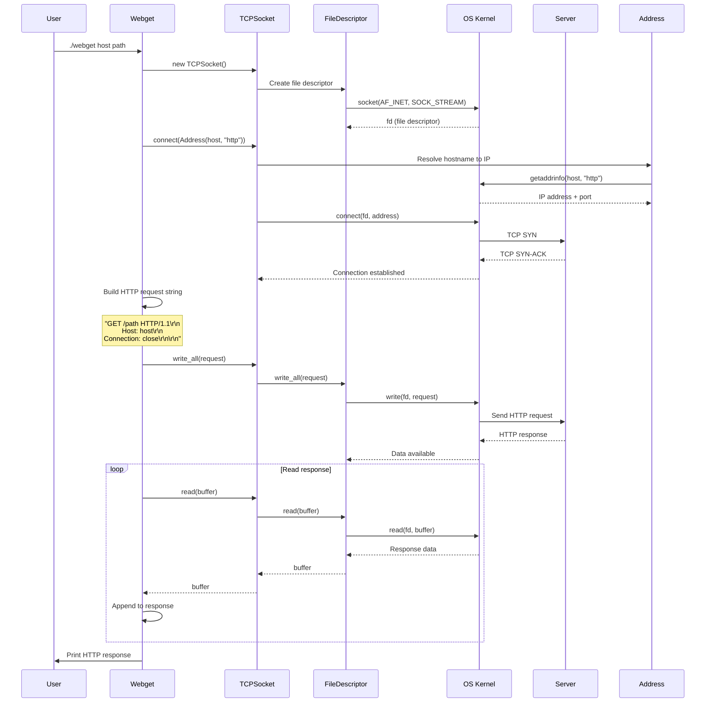
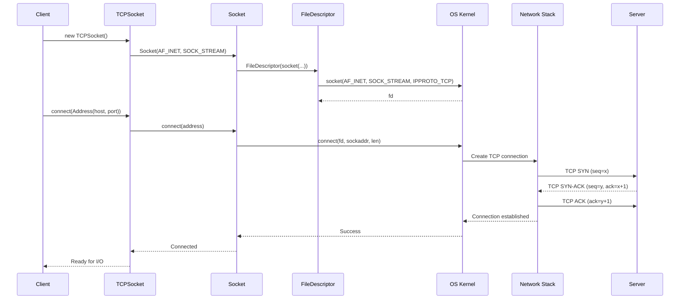

# Stanford CS 144 Networking Lab

[](https://www.apple.com/macos/)
[](https://www.linux.org/)

> **🖥️ macOS Port Available!** This repository has been successfully ported to macOS (Darwin) in addition to the original Linux support. All networking functionality works on both platforms.

These labs are open to the public under the (friendly, but also mandatory) condition that to preserve their value as a teaching tool, solutions not be posted publicly by anybody.

**Website:** https://cs144.stanford.edu

---

## 🚀 Quick Start

### Prerequisites

- **macOS**: Xcode Command Line Tools (`xcode-select --install`)
- **Linux**: Standard build tools (g++, cmake, make)
- **CMake**: Version 3.24.2 or higher

### Build Commands

```bash
# Set up the build system
cmake -S . -B build

# Compile the project
cmake --build build

# Run tests
cmake --build build --target check[checkpoint_num]
# or
cmake --build build --target test

# Run speed benchmarks
cmake --build build --target speed

# Run clang-tidy (code quality checks)
cmake --build build --target tidy

# Format code
cmake --build build --target format
```

### Example: Running webget

```bash
# Build first
cmake --build build

# Run webget
./build/apps/webget cs144.keithw.org /hello
```

---

## 🍎 macOS Compatibility

### ✅ What Works

This codebase has been **fully ported to macOS** and supports:

- ✅ All core networking functionality
- ✅ TCP/UDP sockets
- ✅ HTTP client (webget)
- ✅ Byte stream implementation
- ✅ All test suites (with sanitizers)
- ✅ Cross-platform compilation

### ⚠️ Platform Limitations

Some Linux-specific features are **not available on macOS** (by design):

- ❌ **TUN/TAP devices** - Linux kernel feature, not available on macOS
- ❌ **Packet sockets (AF_PACKET)** - Linux-specific socket type
- ❌ **Raw sockets** - Limited on macOS due to security restrictions

These features will throw runtime errors if used on macOS, which is expected behavior.

---

## 📋 Changes Made for macOS Support

### Platform-Specific Headers and Functions

#### 1. Endianness Functions
**Files:** `util/ipv4_header.cc`, `util/arp_message.cc`, `util/address.cc`

Linux provides `htobe32()` and `be32toh()` functions, but macOS uses `htonl()` and `ntohl()`. Added compatibility macros:

```cpp
#ifndef __linux__
#ifndef htobe32
#define htobe32(x) htonl(x)
#endif
#ifndef be32toh
#define be32toh(x) ntohl(x)
#endif
#endif
```

#### 2. I/O Vector Structure
**File:** `util/file_descriptor.hh`

Different header locations for the same structure:
- **Linux:** `<bits/types/struct_iovec.h>`
- **macOS:** `<sys/uio.h>`

#### 3. Linux-Specific Socket Features
**Files:** `util/socket.hh`, `util/socket.cc`, `util/address.cc`

Conditionally compiled Linux-only features:
- `PacketSocket` class
- `SO_DOMAIN` and `SO_PROTOCOL` socket options
- `sockaddr_ll` structure and `AF_PACKET` family

#### 4. TUN/TAP Devices
**File:** `util/tun.cc`

TUN/TAP devices are Linux kernel features. On macOS, the implementation throws a helpful runtime error.

### Code Fixes

1. **Template Member Access** (`util/ref.hh`)
   - Fixed `borrowed_obj_` access with explicit `this->` qualifier
   - Added `#include <string_view>` for C++17 support

2. **Type Conversions** (`util/socket.cc`, `util/parser.cc`)
   - Fixed narrowing conversion warnings
   - Added explicit type casts for `min()` function

3. **Checksum Calculation** (`util/ipv4_header.cc`)
   - Modified to iterate over `vector<Ref<string>>` and convert to `string_view`

4. **Missing Includes** (`util/helpers.cc`)
   - Added `#include <sstream>`

5. **Test Harness** (`tests/byte_stream_test_harness.hh`, `tests/byte_stream_stress_test.cc`)
   - Fixed return type mismatches (`size_t` vs `uint64_t`)
   - Fixed `uniform_int_distribution<char>` compatibility issue

---

## 🧪 Testing

### Build Status

- ✅ **Compilation:** Successful on both macOS and Linux
- ✅ **Sanitizers:** All tests pass with bug-checkers enabled
- ✅ **Core Functionality:** All networking features work correctly

### Test Results

```bash
# Run all tests
cmake --build build --target test

# Run specific checkpoint
cmake --build build --target check0
cmake --build build --target check1
# etc.

# Run webget test
cmake --build build --target check_webget
```

**Note:** The `nproc: command not found` warning on macOS is expected (it's a Linux command). The build system handles this gracefully.

---

## 📁 Project Structure

```
minnow/
├── apps/              # Application programs (webget, tcp_native, etc.)
├── src/               # Core source code (ByteStream, etc.)
├── util/              # Utility libraries (sockets, parsers, etc.)
├── tests/             # Test suites
├── scripts/           # Build and utility scripts
├── writeups/          # Lab writeups
└── build/             # Build directory (created by cmake)
```

---

## 🏗️ Codebase Architecture & Workflow

### Architecture Overview

The codebase follows a layered architecture:

```
┌─────────────────────────────────────┐
│      Application Layer              │
│  (webget, tcp_native, etc.)        │
└──────────────┬──────────────────────┘
               │
┌──────────────▼──────────────────────┐
│      Socket Layer                   │
│  (TCPSocket, UDPSocket, etc.)       │
└──────────────┬──────────────────────┘
               │
┌──────────────▼──────────────────────┐
│      File Descriptor Layer          │
│  (FileDescriptor, I/O operations)   │
└──────────────┬──────────────────────┘
               │
┌──────────────▼──────────────────────┐
│      System Call Layer              │
│  (socket, connect, read, write)     │
└─────────────────────────────────────┘
```

### Key Components

1. **FileDescriptor** - Wraps Unix file descriptors with reference counting
2. **Socket** - Base class for network sockets
3. **TCPSocket** - TCP stream socket implementation
4. **UDPSocket** - UDP datagram socket implementation
5. **Address** - Network address abstraction (IP + port)
6. **ByteStream** - Buffer management for data streams
7. **Parser/Serializer** - Binary data parsing and serialization

### Workflow: Webget HTTP Client

The `webget` application demonstrates a complete HTTP client workflow:

#### Sequence Diagram: Webget HTTP Request



#### Sequence Diagram: TCP Connection Establishment



#### Data Flow: HTTP Request/Response


### Code Flow Explanation

#### 1. **Webget Initialization**
```cpp
TCPSocket socket;                    // Creates socket file descriptor
socket.connect(Address(host, "http")); // DNS lookup + TCP handshake
```

**What happens:**
- `TCPSocket` constructor calls `Socket(AF_INET, SOCK_STREAM)`
- `Socket` creates a `FileDescriptor` via `socket()` system call
- `connect()` resolves hostname using `getaddrinfo()`
- TCP three-way handshake occurs (SYN → SYN-ACK → ACK)

#### 2. **HTTP Request Sending**
```cpp
socket.write_all(request);  // Sends complete HTTP request
```

**What happens:**
- `write_all()` ensures all data is written (may call `write()` multiple times)
- Data flows: Application → Socket → FileDescriptor → Kernel → Network
- Kernel handles TCP segmentation, IP fragmentation if needed

#### 3. **HTTP Response Reading**
```cpp
while (true) {
    socket.read(buffer);
    if (buffer.empty()) break;
    response.append(buffer);
}
```

**What happens:**
- `read()` blocks until data is available
- Kernel receives TCP segments, reassembles them
- Application reads in chunks until EOF (connection closed)

### Key Design Patterns

1. **RAII (Resource Acquisition Is Initialization)**
   - `FileDescriptor` automatically closes on destruction
   - Reference counting prevents premature closure

2. **Wrapper Pattern**
   - `TCPSocket` wraps low-level socket system calls
   - Provides type-safe, exception-safe interface

3. **Layered Abstraction**
   - Each layer hides complexity of lower layers
   - Applications work with high-level abstractions

### Network Stack Integration

```
Application Layer (webget)
    ↓
Socket API (TCPSocket)
    ↓
File Descriptor (FileDescriptor)
    ↓
System Calls (socket, connect, read, write)
    ↓
Kernel TCP/IP Stack
    ↓
Network Interface
    ↓
Physical Network
```

### Error Handling

- **System Call Errors**: Wrapped in `CheckSystemCall()` which throws exceptions
- **Network Errors**: Detected via socket error codes
- **Connection Failures**: Exceptions propagate to application layer

---

## 🔧 Troubleshooting

### macOS-Specific Issues

**Issue:** `nproc: command not found`  
**Solution:** This is expected. The build system will use alternative methods to detect CPU cores.

**Issue:** TUN/TAP device errors  
**Solution:** These are Linux-only features. Use standard sockets instead.

**Issue:** Packet socket errors  
**Solution:** Use UDP sockets instead of packet sockets on macOS.

### Build Issues

If you encounter build errors:

1. Clean the build directory: `rm -rf build`
2. Reconfigure: `cmake -S . -B build`
3. Rebuild: `cmake --build build`

---

## 📚 Additional Resources

- [Stanford CS144 Course Website](https://cs144.stanford.edu)
- [CMake Documentation](https://cmake.org/documentation/)
- [macOS Development Documentation](https://developer.apple.com/documentation/)

---

## 📝 License & Attribution

This is the Stanford CS144 Networking Lab codebase, ported for macOS compatibility. Original codebase copyright Stanford University.

**Important:** To preserve the value of these labs as a teaching tool, solutions should not be posted publicly.

---

## 🤝 Contributing

If you find issues with the macOS port or have improvements, please:

1. Check existing issues
2. Document the problem clearly
3. Provide steps to reproduce
4. Include your macOS version and Xcode version

---

**Happy Networking! 🚀**
